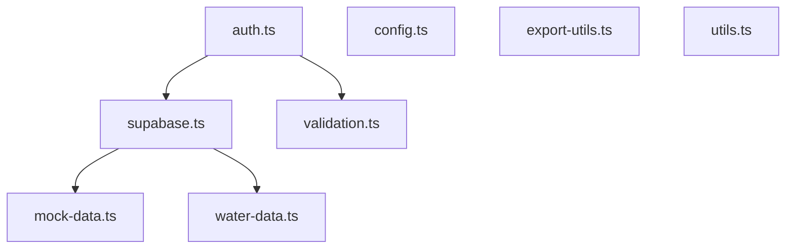

# Library Module Index (`lib/`)

This directory contains the core utility modules for the Muscat Bay application.

## Module Overview

| Module | Description |
|--------|-------------|
| [supabase.ts](./supabase.ts) | Supabase client and all database operations |
| [water-data.ts](./water-data.ts) | Water meter data and analysis functions |
| [mock-data.ts](./mock-data.ts) | Development/fallback mock data |
| [auth.ts](./auth.ts) | Authentication and user profile management |
| [config.ts](./config.ts) | Centralized app configuration |
| [validation.ts](./validation.ts) | Input validation utilities |
| [export-utils.ts](./export-utils.ts) | CSV export functionality |
| [utils.ts](./utils.ts) | General utility functions |

---

## Module Dependencies



---

## Quick Reference

### Adding a New Supabase Table

1. Define the interface in `supabase.ts`
2. Create a transform function if needed
3. Add a fetch function following existing patterns
4. Add corresponding mock data to `mock-data.ts`

### Adding Configuration

All hardcoded values should go in `config.ts`:
```typescript
import { CONFIG } from '@/lib/config';
const rate = CONFIG.STP.TANKER_FEE;
```

### Validation

Use validators from `validation.ts` for all user input:
```typescript
import { validateEmail, sanitizeInput } from '@/lib/validation';
```
